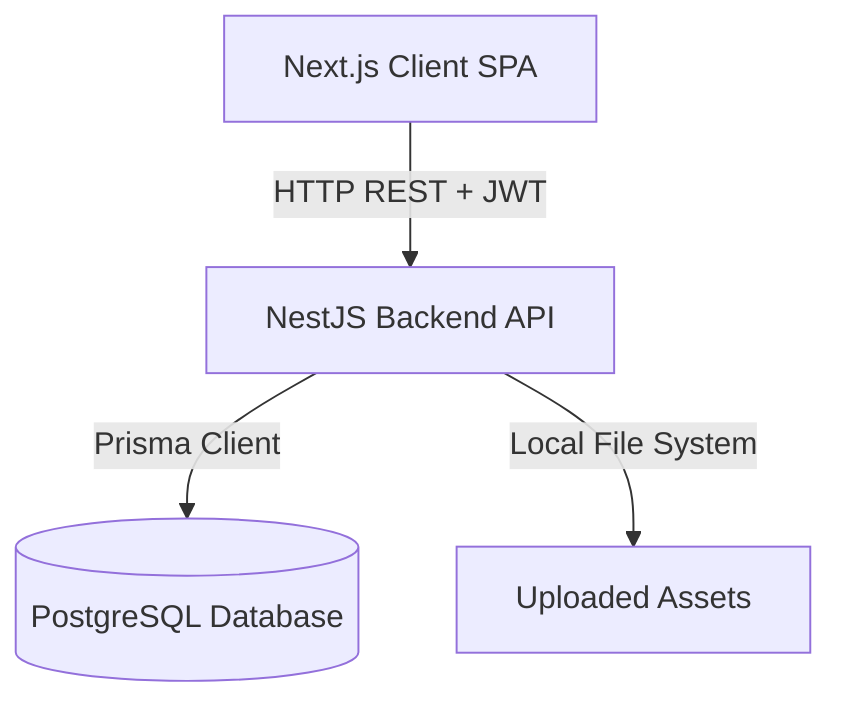
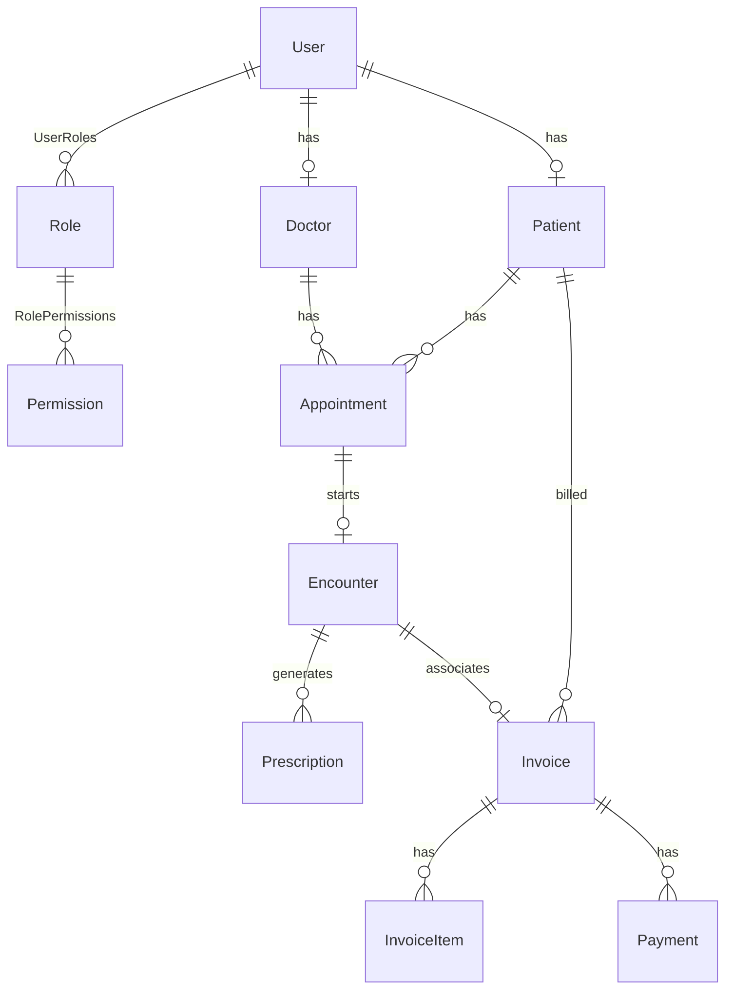
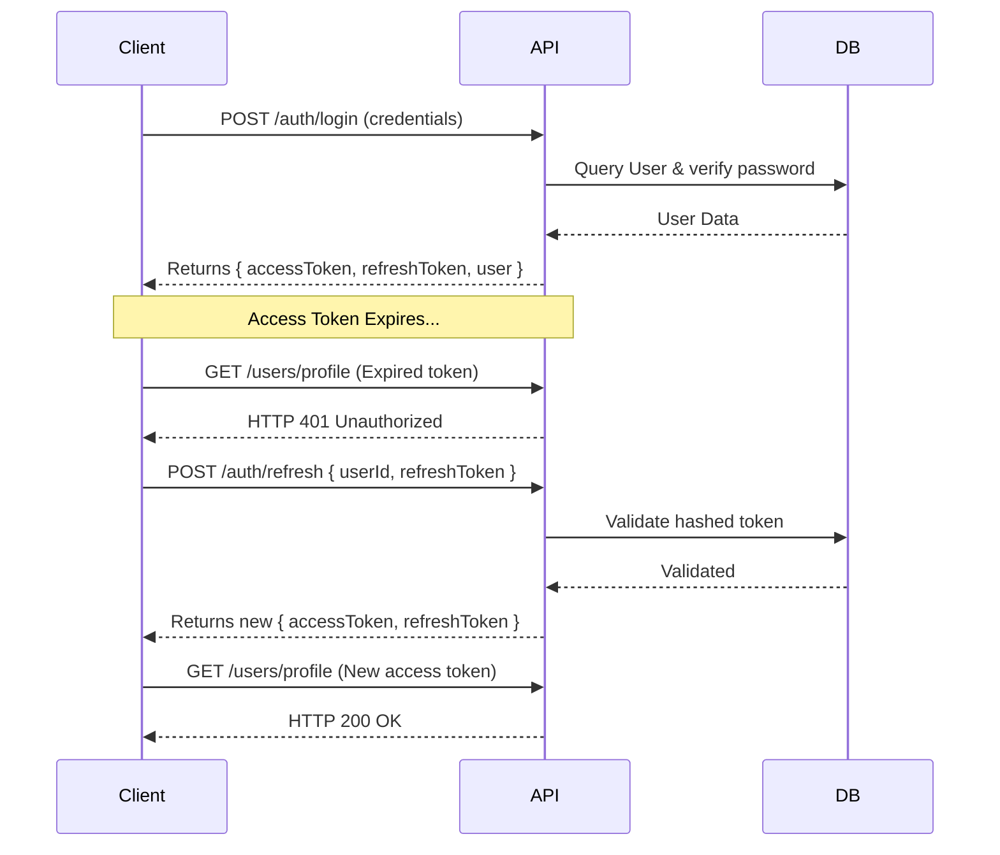

# Clinic Management System - Architecture Documentation

This document describes the architecture, database schema, data flow, and design patterns utilized in the Clinic Management System.

---

## 🏛️ System Overview

The system is designed as a decoupled **Single Page Application (SPA)** architecture:
1. **Frontend**: A client-side Next.js 16 application styled using TailwindCSS, managing state with Zustand (local auth) and React Query (server-state cache).
2. **Backend**: A NestJS REST API using PostgreSQL as a database, integrated via Prisma ORM.

---

## 🗄️ Database Design (Prisma / PostgreSQL Schema)

The database schema enforces relational integrity and optimal indexing for fast searches. Below is the relational entity diagram:

### Key Models & Schemas

#### 1. Authorization Core
- **`User`**: Core authentication model containing `email` and `passwordHash`.
- **`Role`**: Handles roles (`ADMIN`, `DOCTOR`, `RECEPTIONIST`, `PATIENT`).
- **`Permission`**: Defines fine-grained actions (e.g., `view_patients`, `manage_billing`).

#### 2. Clinical Domain
- **`Doctor`**: Stores license number, specialties connection, and references a User.
- **`Patient`**: Stores date of birth, contact number, gender, address, and medical file associations.
- **`DoctorSchedule`**: Manages weekly availability slots (Day of week, Start time, End time) for automated validation.
- **`Appointment`**: Connects a doctor and patient. 
  > [!NOTE]
  > Double-bookings are blocked at the database layer via PostgreSQL `GIST EXCLUDE` constraints applied through raw migrations, ensuring a doctor cannot have overlapping scheduled slots.
- **`Encounter`**: The record of a visit. Includes vitals (height, weight, blood pressure, temperature) and links directly to prescriptions, billing, and uploaded files.

#### 3. Financial Domain
- **`Service`**: Price list of medical treatments/consultations.
- **`Invoice`**: Relates to a Patient. Generated automatically upon Encounter closure or created manually. Supports VAT percentages.
- **`InvoiceItem`**: Individual services attached to the invoice with quantity and actual unit price.
- **`Payment`**: Individual transaction payments linked to an invoice (supports cash/card methods).

---

## 🔑 Authentication & Security Workflow

- **Authentication Protocol**: JWT (JSON Web Tokens) with dual-token validation (Access Token + Refresh Token).
- **Access Token**: Short-lived (15 minutes), sent in the HTTP `Authorization: Bearer <token>` header.
- **Refresh Token**: Long-lived (7 days), stored securely in the database (`hashedRefreshToken`) and used by the frontend to obtain new access tokens silently when they expire.
- **Authorization Guard**: NestJS Guards check user roles on the backend before route execution.
- **Frontend Interceptor**: Axios interceptors intercept `401 Unauthorized` responses and attempt to refresh the token using `/auth/refresh`. If the refresh fails, the user is redirected to `/login`.

---

## 🌀 Frontend State Management Pattern

1. **Zustand (`useAuthStore`)**:
   - Manages global synchronous states like the current user metadata, authentication tokens, and login/logout state.
   - Persisted in `localStorage` to preserve login sessions across page reloads.
2. **React Query (`@tanstack/react-query`)**:
   - Manages asynchronous server state caching (e.g., invoices list, appointments, doctor queues).
   - Optimizes network utilization using cache invalidation queries (e.g., `queryClient.invalidateQueries({ queryKey: ['patients'] })` runs automatically on successful mutational changes).
